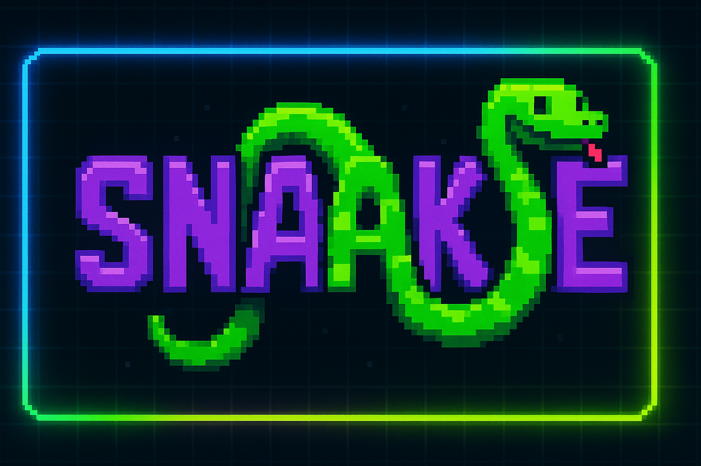

# 🐍 Snaake v1.0

A modern take on the classic Snake game, built with Next.js and featuring retro arcade-style graphics and responsive design.



## ✨ Features

- 🎮 Classic snake gameplay with modern visuals
- 🕹️ Two visual modes: Normal and Pixel art
- 📱 Fully responsive design with touch controls for mobile
- 🌈 Multiple color themes that change each game
- ⚡ Progressive difficulty system
- 💎 Special golden food items for bonus points
- 🏆 Local high score tracking
- 📺 Retro CRT screen effects
- 🎯 D-pad controls for mobile devices

## 🚀 Getting Started

First, install the dependencies:

```bash
npm install
# or
yarn install
# or
pnpm install
```

Then, run the development server:

```bash
npm run dev
# or
yarn dev
# or
pnpm dev
```

Open [http://localhost:3000](http://localhost:3000) with your browser to play the game.

## 🎮 How to Play

- Use arrow keys on desktop or the D-pad on mobile to control the snake
- Collect food to grow longer and increase your score
- Golden food appears randomly and gives bonus points, but disappears quickly
- Avoid hitting the walls or your own tail
- The game speeds up as your score increases
- Try to beat your high score!

## 🎯 Controls

### Desktop

- ⬆️ Arrow Up: Move Up
- ⬇️ Arrow Down: Move Down
- ⬅️ Arrow Left: Move Left
- ➡️ Arrow Right: Move Right
- Enter: Start Game

### Mobile

- Touch-based D-pad controls
- Tap the directional buttons to move

## 🏆 Scoring System

- Regular food: 1 point
- Golden food: 3 points
- Every 5 points increases your level
- Each level increases game speed

## 🎨 Difficulty Levels

- EASY: Levels 1-3
- MEDIUM: Levels 4-6
- HARD: Levels 7-9
- INSANE: Level 10+

## 🛠️ Built With

- [Next.js](https://nextjs.org/) - React Framework
- [Tailwind CSS](https://tailwindcss.com/) - Styling
- [TypeScript](https://www.typescriptlang.org/) - Type Safety
- HTML5 Canvas - Game Rendering

## 📱 Responsive Design

The game is fully responsive and works on:

- 📱 Mobile phones
- 📱 Tablets
- 💻 Desktops
- 🖥️ Large screens

## 🎯 Future Improvements

- [ ] Additional game modes
- [ ] Online leaderboard
- [ ] Power-ups and obstacles
- [ ] Sound effects and music
- [ ] More visual themes

## 📄 License

This project is open source and available under the MIT License.

## Learn More

To learn more about Next.js, take a look at the following resources:

- [Next.js Documentation](https://nextjs.org/docs) - learn about Next.js features and API.
- [Learn Next.js](https://nextjs.org/learn) - an interactive Next.js tutorial.

You can check out [the Next.js GitHub repository](https://github.com/vercel/next.js) - your feedback and contributions are welcome!

## Deploy on Vercel

The easiest way to deploy your Next.js app is to use the [Vercel Platform](https://vercel.com/new?utm_medium=default-template&filter=next.js&utm_source=create-next-app&utm_campaign=create-next-app-readme) from the creators of Next.js.

Check out our [Next.js deployment documentation](https://nextjs.org/docs/app/building-your-application/deploying) for more details.
